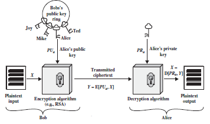
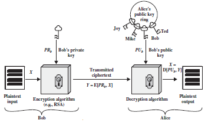

## Asymmetric Ciphers

> - Asymmetric encryption is a form of cryptosystem in which encryption and decryption are performed using the different keys—one a public key
and one a private key. 
> - It is also known as public-key encryption.
> - Asymmetric encryption transforms plaintext into ciphertext using a one of two keys and an encryption algorithm. Using the paired key and a decryption
algorithm, the plaintext is recovered from the ciphertext.
> - Asymmetric encryption can be used for confidentiality, authentication, or both.
> - The most widely used public-key cryptosystem is RSA. 

**Encryption with public key**

**Encryption with private key**

