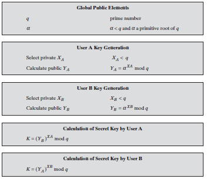

## Diffie-Hellman Key Exchange

> - A simple public-key algorithm for secrete key exchange.
> - It enable two users to securely exchange a key that can then be used for subsequent encryption of messages.
> - The purpose of the algorithm is to The algorithm itself is limited to the exchange of secret values.
> - It is secure only if the authenticity of the two participants can be established.

**Algorithm**

<p align=center>
  
</p>  

**Global public parameters** (Common for both users)

``openssl genpkey -genparam -algorithm DH -out dhp.pem``

**View global parameters**

```
Method 1: cat dhp.pem
Method 2: openssl pkeyparam -in dhp.pem -text
```

**Private key**

``openssl genpkey -paramfile dhp.pem -out PRa.pem``

**View private key**

``openssl pkey -in PRa.pem -text -noout``

**Public key**

``openssl pkey -in PRa.pem -pubout -out PUa.pem``

**View public key**

``openssl pkey -pubin -in PUa.pem -text``

**Secrete key**

``openssl pkeyutl -derive -inkey PRa.pem -peerkey PUb.pem -out SKa.bin``

**View secrete key**

``xxd SKa.bin``

**Verification**

``cmp SKa.bin SKb.bin``           (if SKa.bin and SKb.bin are locally computed)
