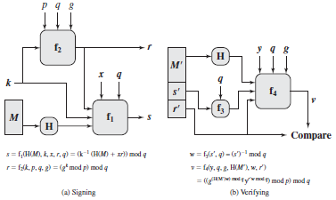
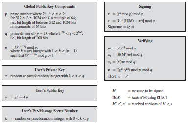

## Digital Signature Algorithm (DSA)

**Procedure**

  

**Algorithm**

  

**Generating DSA parameter file**

``openssl dsaparam -out dsaparam.pem 2048``

**Generating private key**

``openssl gendsa -out privkey.pem dsaparam.pem``

**Generating private key with DES encryption**

``openssl gendsa -des3 -out privkey.pem dsaparam.pem``

**Combining generating DSA parameter and private key**

``openssl dsaparam -genkey 2048 | openssl dsa -out dsa.key -aes128``    (without creating DSA parameter file)

**To remove a pass phrase**

``openssl dsa -in key.pem -out keyout.pem``

**To display private key**

``openssl dsa -in privkey.pem -text -noout``

**To generate public key**

``openssl dsa -in privkey.pem -pubout -out pubkey.pem``

**To display the public key**

``openssl dsa -text -in pubkey.pem -pubin``

### Signing

1. Creating some text file
echo "foobar" > foo.txt

2. Creating hash
openssl sha1 < foo.txt > foo.txt.sha1

3. Signing text file
openssl dgst -sha1 -sign privkey.pem foo.txt.sha1 > foo.txt.sig

### Verifying 

``openssl dgst -dss1 -verify pubkey.pem -signature foo.txt.sig foo.txt.sha1``

### Reference

[openssl dsaparam](https://www.openssl.org/docs/manmaster/man1/enc.html)

[openssl gendsa](https://www.openssl.org/docs/manmaster/man1/gendsa.html)

[openssl dsa](https://www.openssl.org/docs/manmaster/man1/dsa.html)

[openssl How to use OpenSSL](https://opensource.com/article/19/6/cryptography-basics-openssl-part-2)
