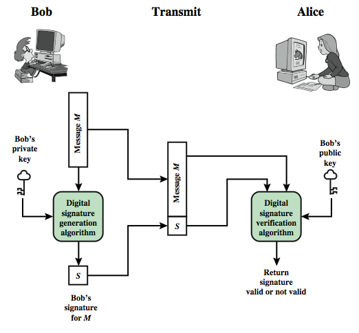
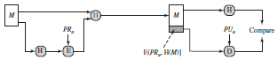
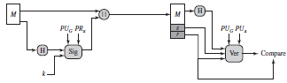

## Digital Signature

> - A digital signature is an authentication mechanism that enables the creator of a message to attach a code that acts as a signature. 
> - A digital signature is formed by taking the hash of the message (MAC) and encrypting the message with the creator’s private key. 
> - A digital signature guarantees the source and integrity of the message.

**Procedure**

<p align=center>
  
</p>  

**Two approaches to Digital Signature**

1. RSA Approach

<p align=center>
  
</p>

2. DSS Approach

<p align=center>
  
</p>

**Generating digest of a file**

```
Syntax:
openssl dgst -<hash_algorithm> -out <digest> <input_file>
```

``openssl dgst -sha256 -out sign.sha256 input.txt``

**Encrypting digest as signature using private key**

```
Method 1:
openssl dgst -sha256 -sign private.pem -out sign.sha256 input.txt
```

```
Synatx:
openssl rsautl -sign -inkey <key> -in <digest> -out <signature> 
```

```
Method 2: 
openssl rsautl -sign -inkey private.pem -keyform PEM -in sign.sha256 > signature (sign.sha256 is the digest of input.txt)
```

**Verifying the signature**

```
Method 1: 
openssl dgst -sha256 -verify public.pem -signature sign.sha256 input.txt
```

```
Syntax:
openssl rsautl -verify -in <signature> -out <digest> -inkey <key> -pubin
```

```
Method 2: 
openssl rsautl -verify -inkey public.pem -keyform PEM -in signature input.txt
```

**Converting signature to Base64 format** (text version)

``openssl base64 -in sign.sha256 -out signature``

**Converting signature to binary format**

``openssl base64 -d -in signature -out sign.sha256``
