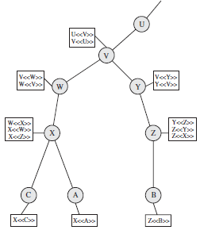

## Create a simple HTTPS server with OenSSL ``s_server``

**New private key with certificate**

``openssl req -x509 -newkey rsa:2048 -keyout key.pem -out cert.pem -days 365 -nodes``

**Starting OpenSSL s_server**

``openssl s_server -key key.pem -cert cert.pem -accept 44330 -www``                   (^c to kill server)

**Accessing s_server through browser**

``https://localhost:44330``

**Accessing s_server through s_client** (View of certificate)

``openssl s_client -connect localhost:44330``                                         (^c to kill client)

``openssl s_client -connect www.google.com:44330``                                    (^c to kill client)

**Accessing s_server through s_client** (Chain of certificates)

``openssl s_client -connect localhost:44330 -showcerts``                              (^c to kill client)

``openssl s_client -connect www.google.com:44330 -showcerts``                         (^c to kill client)

> In case of verify error:num=19:self signed certificate in certificate chain,
> - openssl s_client -connect www.feistyduck.com:443 -CAfile /etc/ssl/certs/ca-certificates.crt

**Chain of Certificates**

  

  

**Testing protocol support**

To test -ssl2 , -ssl3 , -tls1 , -tls1_1 , or -tls1_2 protocol support,

``openssl s_client -connect www.example.com:443 -tls1_2``

**Testing cipher suite support**

``openssl s_client -connect www.feistyduck.com:443 -cipher RC4-SHA``

## Useful Commands

**To list all openssl process with port number and PID**

``sudo netstat -nlp | grep openssl``

**To kill process**

``sudo kill -9 PID``

## References:

1. [Website](https://blog.jorisvisscher.com/2015/07/22/create-a-simple-https-server-with-openssl-s_server/)
