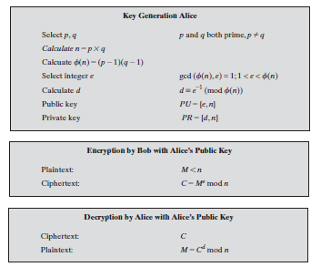
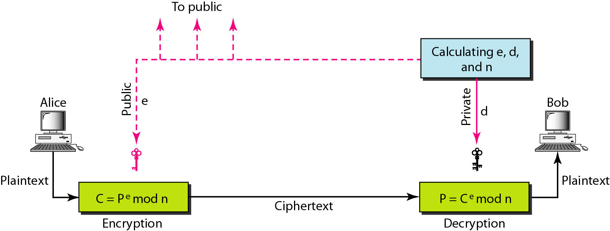
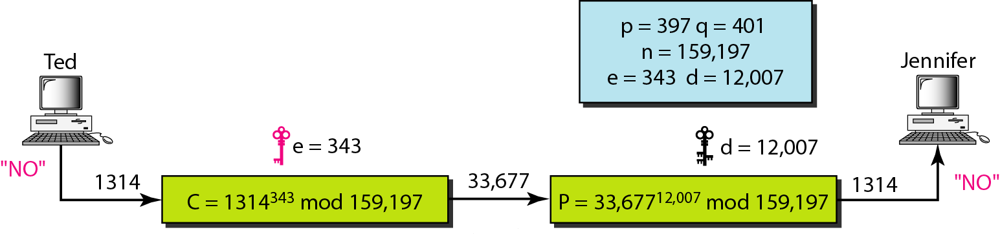

##  Rivest–Shamir–Adleman (RSA)

**Encryption and Decryption**

<p align=center>

</p>

**Private key (n, d)** (without password protection)

```
Method 1: 
openssl genrsa -out private.pem 4096
```

```
Method 2: 
openssl genpkey -algorithm RSA -out private.pem -pkeyopt rsa_keygen_bits:2048
```

```
Method 3: 
openssl genpkey -algorithm RSA -pkeyopt rsa_keygen_bits:2048 -pkeyopt rsa_keygen_pubexp:3 -out private.pem
```

**Private key (n, d)** (with password protection)

```
Method 1: 
openssl genrsa -des3 -out private.pem 2048                              (Interactive)
``` 

```
Method 2: 
openssl genrsa -aes128 -out private.key 2048                            (Interactive)
```

```
Method 3: 
openssl genrsa -aes128 -passout pass:<phrase> -out private.pem 4096     (Non-interactive)
```

**Encrypt private key**

``openssl rsa -des3 -in private.pem -out enc-private.pem``

**Format of RSA private key** (RFC 3447)

```
  RSAPrivateKey ::= SEQUENCE {
      version           Version,
      modulus           INTEGER,  -- n
      publicExponent    INTEGER,  -- e
      privateExponent   INTEGER,  -- d
      prime1            INTEGER,  -- p
      prime2            INTEGER,  -- q
      exponent1         INTEGER,  -- d mod (p-1)
      exponent2         INTEGER,  -- d mod (q-1)
      coefficient       INTEGER,  -- (inverse of q) mod p
      otherPrimeInfos   OtherPrimeInfos OPTIONAL
  }
  ```

**View private key with all parameters** 

```
Method 1:
openssl rsa -text -in private.pem
```

```
Method 2: openssl pkey -text -in private.pem
```

```
Method 3: 
openssl rsa -text -in private.pem -noout                                    (without private key)
```

**View only private key**

``cat private.pem``

**Public key (n, e) from private key**

```
Method 1:
openssl rsa -in private.pem -pubout -out public.pem
```

```
Method 2:
openssl rsa -in private.pem -pubout -out public.pem -outform PEM
```

```
Methdo 3:
openssl rsa -in private.pem -pubout > public.pem
```

```
Method 4:
openssl pkey -in private.pem -out public.pem -pubout
```

**Public key form encrypted private key**

``openssl rsa -in private.pem -passin pass:<phrase> -pubout -out public.pem``

**View public key (n, e) with all parameters**

```
Method 1:
openssl rsa -text -in public.pem -pubin
```

```
Methdo 2:
openssl pkey -text -in public.pem -pubin
```

**View only public key**

``cat public.pem``


**Encryption and Decryption using RSA**

**Procedure**

```
A --> B: CT = E(PUb, PT), PT - Plain Text, CT - Cipher Text, PUb - User B's Public key, E - Encryption

B: PT = D(PRb, CT), D - Decryption 
```
<p align=center>
  
</p>    

**Example**

<p align=center>
  
</p> 

**Encryption** (uses public key of receiver only) 

```
Methdo 1:
openssl rsautl -encrypt -inkey public.pem -pubin -in input.txt -out cipher.bin        (with public key of receiver)
```

```
Methdo 2:
openssl pkeyutl -encrypt -inkey public.pem -pubin -in message.txt -out cipher.bin     (with public key of receiver) 
```

```
Methdo 3:
openssl rsautl -encrypt -inkey private.pem -in input.txt -out cipehr.bin              (with public key of private key of receiver)
```

**Decryption** (uses private key of receiver only)

```
Method 1:
openssl rsautl -decrypt -inkey private.pem -in cipher.bin -out decrypted.txt
```

```
Methdo 2:
openssl pkeyutl -decrypt -inkey private.pem -in cipher.bin -out received-ID.txt
```
