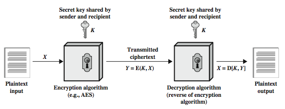
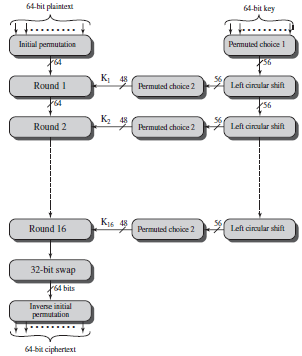
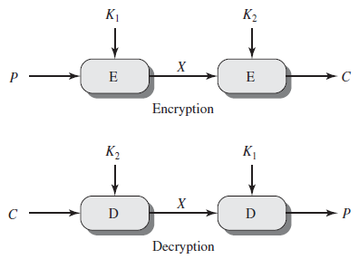
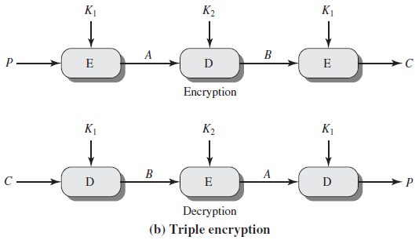
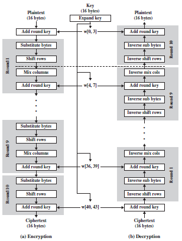

## Symmetric Ciphers (Encryption and Decryption)

**A Simplified Model of Symmetric Encryption**        

### Base64

**Encryption**

``openssl enc -base64 -in number.txt``

### Data Encryption Standard (DES)

**Encryption and Decryption**

**2-DES**

**3-DES**

**Encryption**

``openssl des3 -in file.txt -out file.des3``

**Decryption**

``openssl des3 -d -in file.des3 -out file.txt``

### Advanced Encryption Standard (AES)

**Encryption and Decryption**

**Variants of AES**

**Encryption** (Interactive)

``openssl enc -aes-256-cbc -in plain.txt -out encrypted.bin``

**Encryption** (non-interactive)

``openssl enc -aes-256-cbc -in plain.txt -out encrypted.bin -pass pass:hello``

``sudo openssl enc -aes-256-cbc -salt -in sai.txt -out file.txt.enc -k PASS -a`` (Base64 format output)

**Decryption** (interactive)

``openssl enc -d -aes-256-cbc -in encrypted.bin -out decrypt.txt``

**Decryption** (non-interactive)

``openssl enc -d -aes-256-cbc -in encrypted.bin -out decrypt.txt -pass pass:hello``

``openssl enc -aes-256-cbc -d -in file.txt.enc -k PASS -a``

**View cipertext**

``cat file.txt.enc`` (for Base64 format)

``xxd file.txt.enc`` (for other format)

## Reference

[openssl enc](https://www.openssl.org/docs/manmaster/man1/enc.html)

